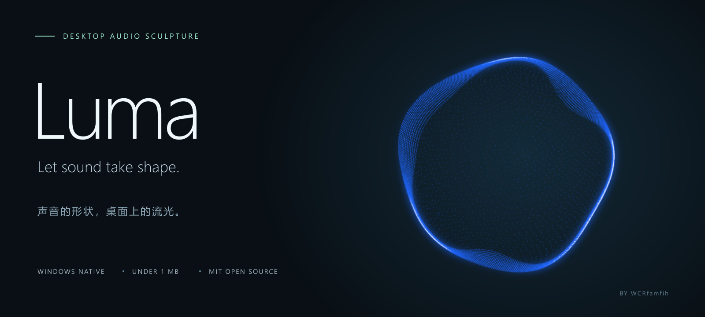

<p align="center">
  
</p>

<p align="center">
  <a href="https://github.com/WCRfamfih/Luma/releases/latest">下载 Windows 版</a> ·
  <a href="#打开即用">使用指南</a> ·
  <a href="#从源码构建">从源码构建</a> ·
  <a href="LICENSE">MIT License</a>
</p>

# Luma / 流光

让声音，在桌面上有了形状。

Luma 是一个轻量的 Windows 原生音频可视化小工具：透明置顶的粒子环随系统声音流动、起伏与呼吸。单个 EXE 不到 1 MB，无需安装；右键托盘图标，在浏览器里实时调整颜色与动态。

**Native C++ · Direct3D 11 · WASAPI · Windows 10 / 11**

## 让音乐推动光

- **柔软的三维粒子体积**：连续三维游转，平滑外轮廓与宽窄不一的内缘卷褶；内部流线随海浪短暂浮现。
- **有惯性的鼓点弹跳**：声音提供起跳力量，阻尼弹簧负责回落；整体缩放、内部弹跳和低频海浪分别控制。
- **快速衰减的大气辉光**：非高斯光晕、随鼓点呼吸、仅密集重叠区域向白色升温。透明留白避免光晕紧贴窗口边框。
- **保留颗粒的抗锯齿**：亚像素覆盖与紧凑 FXAA，减轻摩尔纹和细点闪烁，不依赖历史帧累积。
- **桌面悬浮**：透明、置顶、拖动、滚轮缩放、鼠标穿透，支持球体和光环两种模式。
- **本地网页设置**：「简易 / 高级」两种界面，参数即时生效并自动保存。网页、着色器和图标都嵌入 EXE。

网页提供轻量结构预览；完整辉光与炙热效果请以桌面悬浮窗口为准。横幅使用程序原生渲染画面，非默认参数的固定效果保证。

## 打开即用

从 [Releases](https://github.com/WCRfamfih/Luma/releases/latest) 下载：

| 文件 | 用途 |
| --- | --- |
| **Luma.exe** | 大多数 Windows 10/11 电脑使用的 64 位主程序 |
| Luma-x86.exe | 32 位 Windows 的兼容版本 |
| Luma-1.1.0-Windows.zip | 两种架构、说明、许可证与 SHA-256 校验值 |

1. 双击 **Luma.exe**，程序会打开浏览器设置页。播放音乐、视频或游戏声音即可看到响应，也可开启演示模式。
2. 默认开启置顶、关闭鼠标穿透，可直接拖动，滚轮调整尺寸。在系统托盘右键 Luma 图标，可独立切换「置顶」与「锁定位置 / 鼠标穿透」，选择会自动保存。图标可能位于任务栏的隐藏图标区域。
3. 托盘右键 → **打开设置**，调整颜色、灵敏度、内部粒子、辉光和性能；「高级」提供海浪、三维旋转、回弹和光照细节。
4. 关闭网页后悬浮工具仍会运行；从托盘菜单选择 **退出 Luma** 结束程序。

无需管理员权限，无需安装 .NET、Node、WebView2 或 VC++ 运行库。默认冰川蓝 `#74BFFF`，505px、细腻粒子档、60 FPS 上限和 75% 抗锯齿；内部粒子密度 5%、亮度 30%，光晕范围 1.75×、鼓点呼吸 2×。完整出厂值见 [默认参数](tests/fixtures/factory-defaults.json)；已有本地设置优先保留。

设置保存在 `%LOCALAPPDATA%\Luma\settings.ini`。隐藏、暂停和演示模式是当前会话状态。设置服务只监听 `127.0.0.1`，首选端口 `17863`，占用时自动选择其他端口；从托盘打开可获得当前有效地址。

## 小体积，从原生开始

C++17 静态 CRT，直接使用 Windows 自带的 WASAPI、Direct3D 11 和 DirectComposition。9,216 / 20,736 / 36,864 档粒子实例预算在 GPU 上生成；没有内置浏览器，没有视频纹理素材，也没有额外运行时安装。

无声音时最高 30 FPS，隐藏时停止 GPU 绘制。音频只在内存中分析，不录制、不上传；程序没有账户或遥测。文件大小与运行内存是不同指标，实际性能取决于画面尺寸、参数、显卡和显示器。

## 兼容性

- Windows 10/11，支持 Direct3D feature level 11 的显卡。硬件初始化失败时尝试 WARP 软件渲染，并限制到 30 FPS。
- 提供 x64 和 x86；Windows ARM 的模拟运行尚未实机验证。Windows 7/8 不在支持范围内。
- 系统声音来自默认多媒体输出设备；独占模式和受保护音频不保证可采集。
- 置顶适用于普通桌面。独占全屏、安全桌面或特殊系统窗口可能覆盖悬浮效果。
- 当前便携版本未做代码签名。

## 从源码构建

安装 Visual Studio 2022 或 Build Tools 的 **使用 C++ 的桌面开发** 组件及 Windows SDK，在仓库根目录运行：

```powershell
.\build.ps1
.\build.ps1 -Architecture x86
.\package.ps1
```

输出位于 `dist/`。`Luma.exe` 是主入口；`Luma-x64.exe` 是内容相同的开发用名称。图标由构建脚本生成，EXE、窗口和托盘共享同一图案。构建采用 `/MT /O2 /LTCG`，发布脚本校验 50 MB 大小上限。

```powershell
.\dist\Luma.exe --self-test # FFT、瞬态和弹簧数值检查
.\dist\Luma.exe --quiet     # 不自动打开浏览器
```

图像、API、真实音频与双架构检查见 [测试说明](tests/README.md)，渲染架构见 [design.md](design.md)。GitHub Actions 自动构建两种架构并运行数值自检；完整图形测试需要本地 Windows 桌面。

## 开源与致谢

采用 [MIT License](LICENSE)，允许使用、修改、商用和再分发，请保留版权与许可证。

视觉灵感来自音乐粒子可视化；本项目为独立实现，不包含 NCS 图片、音乐或商标素材，与 NCS 无关联。

接口与方法参考：[WASAPI loopback](https://learn.microsoft.com/en-us/windows/win32/coreaudio/loopback-recording)、[DirectComposition 交换链](https://learn.microsoft.com/en-us/windows/win32/api/dxgi1_2/nf-dxgi1_2-idxgifactory2-createswapchainforcomposition)、[NVIDIA FXAA white paper](https://developer.download.nvidia.com/assets/gamedev/files/sdk/11/FXAA_WhitePaper.pdf)。抗锯齿采用自己的紧凑实现，未集成完整 FXAA SDK。架构调研参考过 [PowerAudio](https://github.com/7PH/poweraudio)，未复制其代码。
